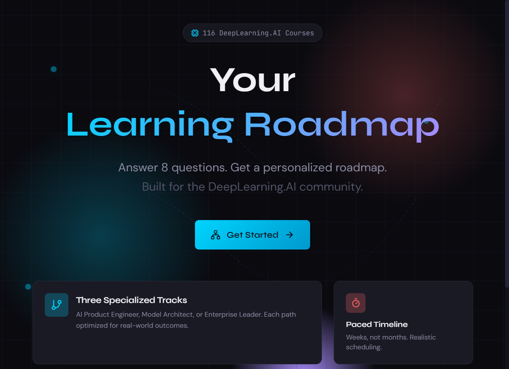

# DeepLearning.AI Learning Roadmap Generator

[](LICENSE)

A personalized pathway generator that transforms DeepLearning.AI's 100+ courses into customized learning roadmaps based on your goals, experience, and schedule.

**[Try it live](https://belumume.github.io/dlai-roadmap/)**



## Features

- **Smart Questionnaire**: 8-question assessment capturing your experience level, goals, time commitment, and interests
- **3 Career Paths**: AI Product Engineer, Model Architect, or Enterprise AI Leader
- **Personalized Timeline**: Week-by-week schedule based on your availability
- **Progress Tracking**: Mark courses complete and track your journey
- **PDF Export**: Download your roadmap to print or share
- **Calendar Export**: Export to .ics for Google Calendar, Outlook, etc.
- **Shareable URLs**: Generate links with your preferences encoded

## How It Works

1. **Answer Questions**: Complete a quick 8-question assessment about your background and goals
2. **Get Your Roadmap**: Receive a personalized sequence of courses organized into phases
3. **Track Progress**: Mark courses complete as you learn
4. **Export & Share**: Download as PDF or share your roadmap with others

## Tech Stack

- React + Vite
- Tailwind CSS
- jsPDF (PDF export)
- Lucide React (icons)

## Local Development

```bash
# Install dependencies
npm install

# Start dev server
npm run dev

# Build for production
npm run build
```

## Course Data

The application uses a curated dataset of 100+ DeepLearning.AI courses with metadata including:
- Difficulty level (beginner/intermediate/advanced)
- Estimated hours
- Categories and topics
- Career path alignment
- Prerequisites

## Contributing

Built by [Learning Deep](https://community.deeplearning.ai/u/learningdeep/) for the DeepLearning.AI community.

Feel free to open issues or PRs to improve the roadmap generator!

## License

MIT
