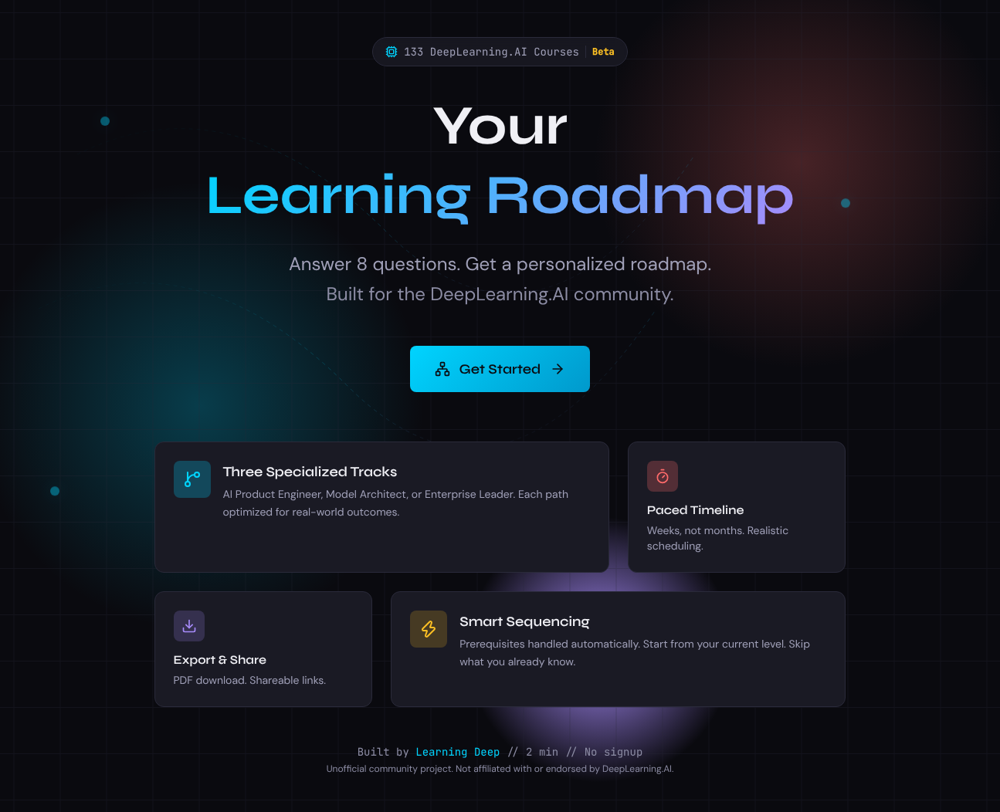

# DLAI Roadmap: AI Learning Path Generator (Unofficial)

[](LICENSE)

A personalized pathway generator that transforms DeepLearning.AI's 100+ courses into customized learning roadmaps based on your goals, experience, and schedule.

**[Try it live](https://belumume.github.io/dlai-roadmap/)**

> Unofficial community project. Not affiliated with or endorsed by DeepLearning.AI. Course names and links belong to their respective owners.



## Features

- **Smart Questionnaire**: 8-question assessment capturing your experience level, goals, time commitment, and interests
- **3 Career Paths**: AI Product Engineer, Model Architect, or Enterprise AI Leader
- **Personalized Timeline**: Week-by-week schedule based on your availability
- **Progress Tracking**: Mark courses complete and track your journey
- **PDF Export**: Download your roadmap to print or share
- **Calendar Export**: Export to .ics for Google Calendar, Outlook, etc.
- **Shareable URLs**: Generate links with your preferences encoded
- **No signup**: Progress is saved in your browser (localStorage)

## How It Works

1. **Answer Questions**: Complete a quick 8-question assessment about your background and goals
2. **Get Your Roadmap**: Receive a personalized sequence of courses organized into phases
3. **Track Progress**: Mark courses complete as you learn
4. **Export & Share**: Download as PDF, export to calendar, or share via link

## Tech Stack

- React 19 + Vite 8
- Tailwind CSS 4
- jsPDF (PDF export, loaded only when you export)
- Lucide React (icons)
- Static JSON data, no backend; deployed to GitHub Pages

## Local Development

Requires Node.js 22.12 or newer (`.nvmrc` pins the version CI uses).

```bash
npm ci                      # Install dependencies
npm run dev                 # Start dev server at http://localhost:5173/dlai-roadmap/
npm run lint                # ESLint
npm run build               # Production build
npx playwright install chromium   # Once, to get a test browser
npm test                    # Playwright end-to-end tests
```

Every pull request runs lint, build and the Playwright suite in GitHub Actions, and a push to `main` deploys only after the same checks pass.

## Course Data

`src/data/courses.json` holds 133 DeepLearning.AI courses and the pathway definitions. Every course carries:
- Difficulty level (beginner/intermediate/advanced)
- Estimated hours
- Categories, skills taught and partner
- Career path alignment
- Prerequisites

Course details are checked against the live DeepLearning.AI course pages; see [`docs/solutions/`](docs/solutions/) for the verification method.

## Privacy

The live site uses [PostHog](https://posthog.com) (EU region) for anonymous usage analytics: page views and events such as roadmap generated or PDF exported, with your chosen path, experience, goal and weekly hours. No name or email is collected, and analytics sets no cookies and stores nothing in your browser, so there is no consent banner. Local development and automated test runs send nothing.

## Contributing

Built by [Learning Deep](https://community.deeplearning.ai/u/learningdeep/) for the DeepLearning.AI community.

Feel free to open issues or PRs to improve the roadmap generator!

## License

MIT
